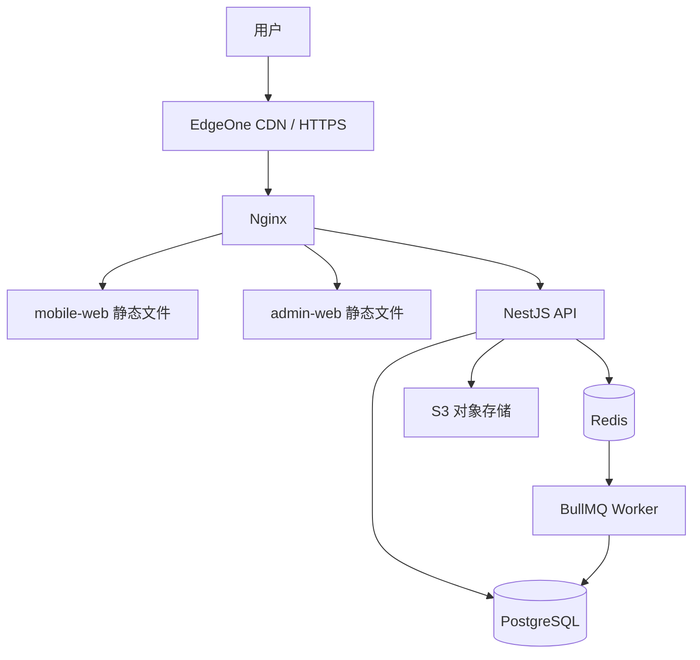

# 部署设计

## 生产拓扑

## Docker Compose 服务

- `siyu-nginx`
- `siyu-api`
- `siyu-worker`
- `siyu-postgres`
- `siyu-redis`

开发 Compose 中 PostgreSQL、Redis 与 Nginx 端口仅绑定 `127.0.0.1`。应用启动不得自动执行迁移；
迁移必须由显式发布步骤执行。

五个常驻容器均配置健康检查：PostgreSQL 使用 `pg_isready`，Redis 使用 `PING`，API 检查
`/health`，Worker 检查 Redis TCP 链路，Nginx 通过自身代理检查 `/health`。Nginx 使用 Docker
内置 DNS 动态解析 `siyu-api`，API 容器地址变化后不得要求重启 Nginx 才能恢复代理。

## 非 Docker 原生模式

Docker 不是应用运行的强制依赖。原生模式由 Node.js 直接运行 API、Worker、手机端/管理端开发服务器，或在
生产环境运行 API、Worker 与 Node 静态网关；PostgreSQL 和 Redis/Valkey 使用本机服务、独立服务器或云服务。

- `pnpm native:check`：检查 Node、环境 URL 和 PostgreSQL/Redis TCP 连通性。
- `pnpm native:migrate`：对 `DATABASE_URL` 显式执行生产迁移。
- `pnpm dev:native`：启动 API、Worker 和两个 Vite 开发服务。
- `pnpm start:native`：启动已构建 API、Worker 和监听 `127.0.0.1:8080` 的静态网关。

生产原生网关应置于 Caddy/Nginx/EdgeOne HTTPS 之后。详细环境、systemd 和更新步骤见
`docs/architecture/NATIVE_RUNTIME.md`。原生模式不改变数据库、Redis、迁移、备份、权限或幂等要求。

## 环境

- development
- staging
- production

不同环境必须分离数据库、Redis、OAuth 回调、JWT 密钥、对象存储前缀和日志配置。

## Nginx 路由

- `/` -> mobile-web
- `/admin/` -> admin-web
- `/api/` -> API
- `/health` -> API 健康检查

本地 Nginx 入口为 `http://localhost:8080`。生产域名、OAuth、JWT 与对象存储配置在 TASK-000
中仅保留环境变量占位，不写入真实值。

## 数据库

- 每日全量备份
- 保留 7–30 天
- 定期恢复验证
- 迁移在发布阶段显式执行
- 禁止应用启动时自动执行破坏性迁移

## 发布

1. 构建镜像或原生 Node 产物和前端资源
2. 运行 lint、类型、测试和构建
3. 备份数据库
4. staging 执行迁移
5. E2E 和冒烟
6. 生产迁移
7. 滚动更新 API/Worker
8. 更新前端
9. 验证健康、登录、记账和 Worker
10. 记录版本和回滚点

## 回滚

- 应用镜像回滚到上一版本
- 高风险迁移提供向前修复和必要回滚脚本
- 发现重复入账时先停 Worker，再处理数据
