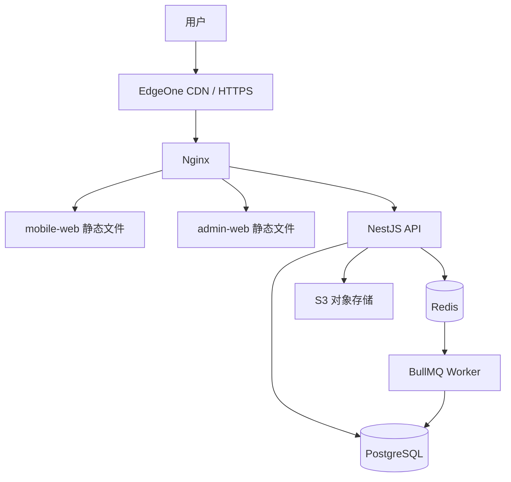

# 部署设计

## 生产拓扑


```mermaid
flowchart TB
    U[用户] --> E[EdgeOne CDN / HTTPS]
    E --> N[Nginx]
    N --> M[mobile-web 静态文件]
    N --> A[admin-web 静态文件]
    N --> API[NestJS API]
    API --> PG[(PostgreSQL)]
    API --> R[(Redis)]
    R --> W[BullMQ Worker]
    W --> PG
    API --> S3[S3 对象存储]
```

## Docker Compose 服务

- `siyu-nginx`
- `siyu-api`
- `siyu-worker`
- `siyu-postgres`
- `siyu-redis`

开发 Compose 中 PostgreSQL、Redis 与 Nginx 端口仅绑定 `127.0.0.1`。应用启动不得自动执行迁移；
迁移必须由显式发布步骤执行。

Compose 默认以 `NODE_ENV=development` 提供本机可运行基线。用于 staging/production 时必须显式设置
`NODE_ENV=production`、独立强随机 `JWT_SECRET`、`SIYU_COOKIE_SECURE=true` 和真实邮件提供方；生产配置
复用仓库默认密钥、关闭 Secure Cookie 或设置 `SIYU_MAIL_PROVIDER=test` 会失败启动。API 容器显式使用
`SIYU_API_HOST=0.0.0.0`，宿主仍只通过 Nginx 的 `127.0.0.1:8080` 暴露。

五个常驻容器均配置健康检查：PostgreSQL 使用 `pg_isready`，Redis 使用 `PING`，API 检查
`/health`，Worker 检查 Redis TCP 链路，Nginx 通过自身代理检查 `/health`。Nginx 使用 Docker
内置 DNS 动态解析 `siyu-api`，API 容器地址变化后不得要求重启 Nginx 才能恢复代理。

Worker 启动后注册 `siyu-recurring-due` Job Scheduler 并立即发起一次按分钟去重的扫描。扫描间隔、批量、
并发、重试次数和指数退避基准可通过 `.env.example` 中的 `SIYU_RECURRING_*` 变量调整；修改前应观察等待、
运行、延迟和失败任务数。滚动更新可以并行短暂运行多个 Worker，稳定 Job ID 和数据库约束保证至少一次投递安全。

## 非 Docker 原生模式

Docker 不是应用运行的强制依赖。原生模式由 Node.js 直接运行 API、Worker、手机端/管理端开发服务器，或在
生产环境运行 API、Worker 与 Node 静态网关；PostgreSQL 和 Redis/Valkey 使用本机服务、独立服务器或云服务。

- `pnpm native:check`：检查 Node、环境 URL 和 PostgreSQL/Redis TCP 连通性。
- `pnpm native:migrate`：对 `DATABASE_URL` 显式执行生产迁移。
- `pnpm dev:native`：启动 API、Worker 和两个 Vite 开发服务。
- `pnpm start:native`：启动已构建 API、Worker 和监听 `127.0.0.1:8080` 的静态网关。

生产原生网关应置于 Caddy/Nginx/EdgeOne HTTPS 之后。详细环境、systemd 和更新步骤见
`docs/architecture/NATIVE_RUNTIME.md`。原生模式不改变数据库、Redis、迁移、备份、权限或幂等要求。
API 自身也默认监听 `127.0.0.1`；只有经过批准的容器或隔离网络部署才可显式修改 `SIYU_API_HOST`。

## 环境

- development
- staging
- production

不同环境必须分离数据库、Redis、OAuth 回调、JWT 密钥、对象存储前缀和日志配置。

生产环境从 `.env.production.example` 建立由秘密管理系统托管的环境文件。发布前必须显式选择运行模式并执行：

```bash
pnpm release:check -- --env-file /secure/path/siyu-production.env --mode native
# 或：
pnpm release:check -- --env-file /secure/path/siyu-production.env --mode compose
```

检查结果不打印 JWT、数据库密码、Redis 密码或 QQ App Key。当前仓库尚无已批准生产邮件适配器，因此检查会
以 `MAIL_PROVIDER` 失败，Worker 生产启动也会以 `MAIL_PROVIDER_UNCONFIGURED` 或
`MAIL_PROVIDER_UNSUPPORTED` 失败关闭；不得通过填写任意字符串绕过。

## Nginx 路由

- `/` -> mobile-web
- `/admin/` -> admin-web
- `/api/` -> API
- `/health` -> API 健康检查

本地 Nginx 入口为 `http://localhost:8080`。生产域名、OAuth、JWT 与对象存储配置在 TASK-000
中仅保留环境变量占位，不写入真实值。

## 数据库

- 每日全量备份
- 保留 7–30 天
- 定期恢复验证
- 迁移在发布阶段显式执行
- 禁止应用启动时自动执行破坏性迁移

发布前备份必须写到仓库之外，并在迁移前验证校验和与隔离恢复：

```bash
pnpm release:backup -- \
  --database-url "$DATABASE_URL" \
  --output-dir /var/backups/siyu

pnpm release:restore:verify -- \
  --backup /var/backups/siyu/siyu-YYYYMMDDTHHMMSSZ.dump \
  --target-url "$SIYU_RESTORE_DATABASE_URL" \
  --cleanup
```

备份使用 PostgreSQL custom format，文件与元数据权限为 `0600`，元数据记录 SHA-256 但不含密码。恢复目标
数据库名必须匹配 `siyu_restore_*`、不得与源库同名，且默认只允许本机；远程 staging 隔离库必须显式
`--allow-remote`。Compose 场景可增加 `--postgres-container <postgres-container>`，使备份与恢复使用
数据库容器内同版本客户端。

## 发布

1. 构建镜像或原生 Node 产物和前端资源
2. 运行 lint、类型、测试和构建
3. 备份数据库
4. staging 执行迁移
5. E2E 和冒烟
6. 生产迁移
7. 滚动更新 API/Worker
8. 更新前端
9. 验证健康、登录、记账和 Worker
10. 记录版本和回滚点

构建产物或 staging 入口启动后执行只读冒烟：

```bash
pnpm release:smoke -- --base-url https://your-siyu-domain.example --expect-production
```

该命令验证 `/health`、手机端、管理端、未认证保护和统一安全响应头。登录、记账、查询、任务与幂等仍必须在
隔离 staging 使用完整 `pnpm test:e2e` 或专用验收账号验证；只读冒烟不替代业务 E2E。

已启动 Chrome DevTools Protocol 端口时，可对手机端登录入口执行三尺寸双主题真浏览器检查：

```bash
pnpm release:browser:smoke -- \
  --cdp-url http://127.0.0.1:9223 \
  --base-url http://127.0.0.1:8080 \
  --screenshot-dir /secure/path/release-evidence
```

该检查覆盖 320px、375px、480px 的日间/夜间主题、横向溢出、正式品牌和可见交互区 44px 下限；截图目录
必须位于仓库之外，验收产物不得提交。

## 回滚

- 应用镜像回滚到上一版本
- 高风险迁移提供向前修复和必要回滚脚本
- 发现重复入账时先停 Worker，再处理数据
