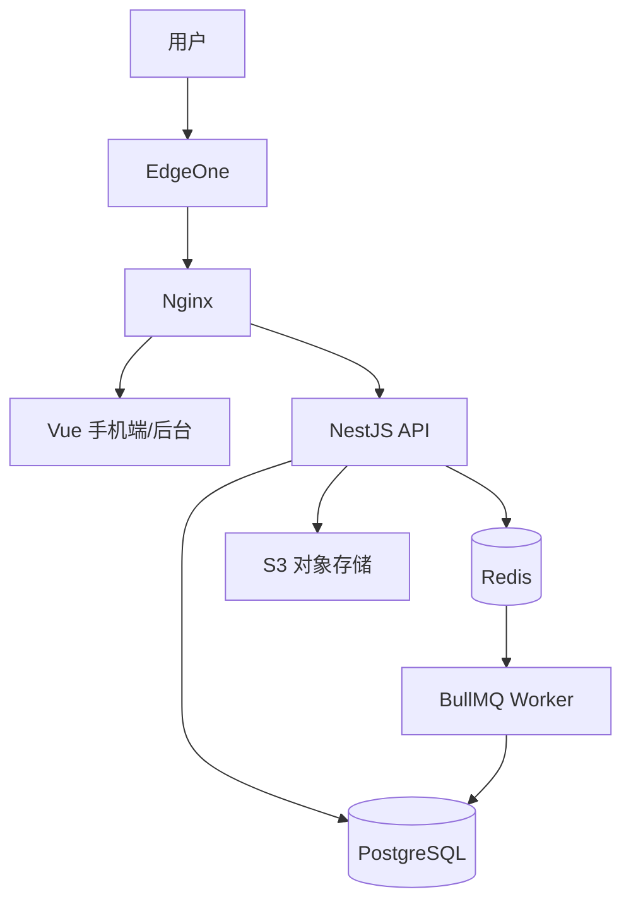

# 技术架构

## 总体方案

采用模块化单体 + 独立 Worker：

- 手机端：Vue 3 + TypeScript + Vite + Pinia + Vue Router + Ant Design Vue + ECharts
- 管理后台：Vue 3 + TypeScript + Vite + Ant Design Vue + ECharts
- API：NestJS + TypeScript + Prisma
- 数据库：PostgreSQL
- 缓存/队列：Redis + BullMQ
- 文件：S3 兼容对象存储
- 部署：Docker Compose + Nginx + EdgeOne
- 测试：Vitest/Jest + Supertest + Playwright

## 仓库结构

```text
siyu/
├── apps/
│   ├── mobile-web/
│   ├── admin-web/
│   └── api/
├── packages/
│   ├── shared-types/
│   ├── validation/
│   └── ui-tokens/
├── docs/
├── scripts/
├── AGENTS.md
├── docker-compose.yml
└── pnpm-workspace.yaml
```

根包名为 `siyu`。应用包为 `@siyu/mobile-web`、`@siyu/admin-web`、`@siyu/api`；共享包为
`@siyu/shared-types`、`@siyu/validation`、`@siyu/ui-tokens`。Node.js 基线为 24 LTS，pnpm
版本由根 `packageManager` 固定。

## 后端模块

- AuthModule
- UserModule
- LedgerModule
- EntryModule
- CategoryModule
- DebtModule
- RecurringModule
- SalaryModule
- SavingGoalModule
- StatisticsModule
- NotificationModule
- FileModule
- AuditModule
- AdminModule

每个模块包含 Controller、Service、Repository、DTO、Policy、Validator 和测试。

## 数据流



## API 约定

- 前缀：`/api/v1`
- JSON
- Access Token + Refresh Token
- 统一 `requestId`
- 统一分页、错误码和金额单位
- 日期 `YYYY-MM-DD`
- 系统时间 ISO 8601 UTC
- 写接口支持幂等键或业务唯一约束
- 客户端幂等键作用域为“用户 + 操作 + Key”；相同载荷重放既有结果，不同载荷返回 409
- API 金额限制在 JavaScript 安全整数范围内

## API 与 Worker 边界

- API 负责认证、授权、校验、同步事务、任务投递与 `/health`。
- Worker 只消费 BullMQ 任务，不暴露业务 HTTP 接口，不复制领域规则。
- TASK-000 只建立两个入口和 Redis 连接能力，不注册业务 Controller、Repository 或 Job。

## 统计

MVP 直接聚合 `entries`，通过索引和短期缓存满足查询。数据量增长后再引入日/月汇总表。

## 关键架构原则

1. 所有金额使用整数分。
2. 普通账目通过账本权限隔离。
3. 私有模块通过用户归属隔离。
4. 特殊模块通过来源唯一键关联普通账目。
5. 周期实例和自动账目使用数据库唯一约束保证幂等。
6. 复杂写操作使用数据库事务。
7. API 和 Worker 共用领域服务，禁止复制两套业务逻辑。
8. 管理后台默认不提供直接修改用户财务数据的能力。
