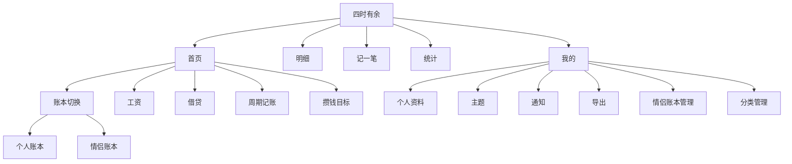

# 信息架构

## 底部导航

1. 首页
2. 明细
3. 记账
4. 统计
5. 我的

“记账”使用中间突出入口。

## 一级功能结构

## 页面路由

- `/login`
- `/home`
- `/entries`
- `/entries/new`
- `/entries/:id`
- `/categories`
- `/statistics`
- `/debts`
- `/debts/new`
- `/debts/:id`
- `/recurring`
- `/recurring/new`
- `/recurring/:id`
- `/salary`
- `/salary/:year/:month`
- `/salary/year/:year`
- `/saving-goals`
- `/saving-goals/new`
- `/saving-goals/:id`
- `/couple/invite`
- `/couple/join`
- `/notifications`
- `/exports`
- `/profile`
- `/settings`
