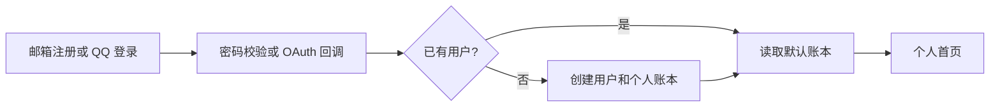
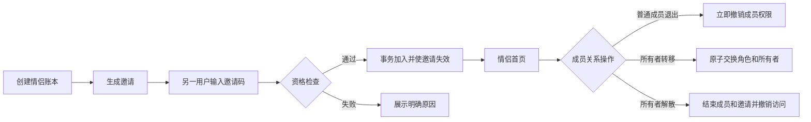
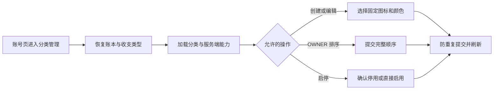
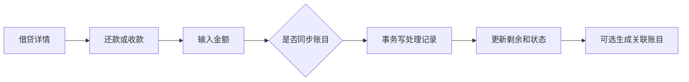
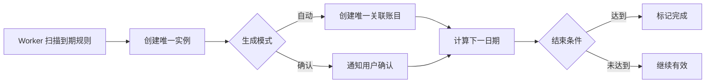
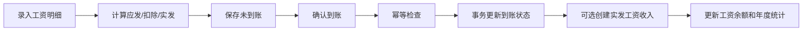
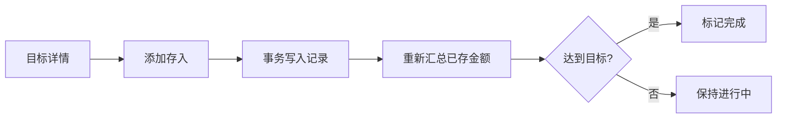

# 页面与业务流程

## 登录与初始化

```mermaid
flowchart LR
    A[邮箱注册或 QQ 登录] --> B[密码校验或 OAuth 回调]
    B --> C{已有用户?}
    C -->|否| D[创建用户和个人账本]
    C -->|是| E[读取默认账本]
    D --> E
    E --> F[个人首页]
```

## 情侣账本

```mermaid
flowchart LR
    A[创建情侣账本] --> B[生成邀请]
    B --> C[另一用户输入邀请码]
    C --> D{资格检查}
    D -->|通过| E[事务加入并使邀请失效]
    D -->|失败| F[展示明确原因]
    E --> G[情侣首页]
    G --> H{成员关系操作}
    H -->|普通成员退出| I[立即撤销成员权限]
    H -->|所有者转移| J[原子交换角色和所有者]
    H -->|所有者解散| K[结束成员和邀请并撤销访问]
```

## 快速记账

```mermaid
flowchart LR
    A[点击记账] --> B[选择收入/支出]
    B --> C[输入金额]
    C --> D[选择分类]
    D --> E[日期/备注/支付方式]
    E --> F[防重复提交]
    F --> G[保存]
    G --> H[更新列表和统计]
```

## 分类管理

```mermaid
flowchart LR
    A[账号页进入分类管理] --> B[恢复账本与收支类型]
    B --> C[加载分类与服务端能力]
    C --> D{允许的操作}
    D -->|创建或编辑| E[选择固定图标和颜色]
    D -->|OWNER 排序| F[提交完整顺序]
    D -->|启停| G[确认停用或直接启用]
    E --> H[防重复提交并刷新]
    F --> H
    G --> H
```

## 借贷处理

```mermaid
flowchart LR
    A[借贷详情] --> B[还款或收款]
    B --> C[输入金额]
    C --> D{是否同步账目}
    D --> E[事务写处理记录]
    E --> F[更新剩余和状态]
    F --> G[可选生成关联账目]
```

## 周期任务

```mermaid
flowchart LR
    A[Worker 扫描到期规则] --> B[创建唯一实例]
    B --> C{生成模式}
    C -->|自动| D[创建唯一关联账目]
    C -->|确认| E[通知用户确认]
    D --> F[计算下一日期]
    E --> F
    F --> G{结束条件}
    G -->|达到| H[标记完成]
    G -->|未达到| I[继续有效]
```

## 工资到账

```mermaid
flowchart LR
    A[录入工资明细] --> B[计算应发/扣除/实发]
    B --> C[保存未到账]
    C --> D[确认到账]
    D --> E[幂等检查]
    E --> F[事务更新到账状态]
    F --> G[可选创建实发工资收入]
    G --> H[更新工资余额和年度统计]
```

## 攒钱

```mermaid
flowchart LR
    A[目标详情] --> B[添加存入]
    B --> C[事务写入记录]
    C --> D[重新汇总已存金额]
    D --> E{达到目标?}
    E -->|是| F[标记完成]
    E -->|否| G[保持进行中]
```
